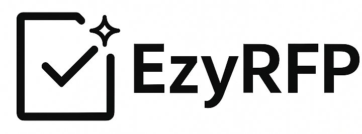

# EzyRFP – AI-Powered RFP Management Platform   

**[Watch Product Demo](https://drive.google.com/file/d/14YdkKhlbYHDiHxhz8yhtW3Ma6zeinzDu/view?usp=sharing)**  
**[Visit Product Page](https://ezyrfp.com)**  

---

## Overview  
EzyRFP is an AI-powered Request for Proposal (RFP) management platform commissioned by **Meher Consulting** and developed to streamline vendor evaluation, automate scoring, and generate executive summaries within a unified interface.  
The platform demonstrates the integration of no-code development with OpenAI’s Assistant API to automate proposal analysis and decision support.  

---

## Problem Statement  
Traditional RFP evaluations are often slow, manual, and subjective.  
EzyRFP addresses this by automating vendor assignment, response collection, and scoring, transforming the process into a fast, consistent, and data-driven workflow.  

---

## Key Features  
• AI-generated vendor questions derived from RFP documents  
• Automated scoring with configurable question weightage  
• Executive summaries for each proposal  
• Leaderboard for vendor comparison  
• Separate client and vendor portals with secure access  

---

## Technical Stack  

| Component | Technology Used |
|------------|-----------------|
| Platform | Bubble.io |
| AI Layer | OpenAI Assistant API |
| Data Objects | `Rfp`, `RfpAnswers`, `RfpQuestion`, `RfpResponse`, `RfpResponseFile`, `RfpResponseMaster`, `RfpAssignment`, `User`, `Vendors` |

---

## How It Works  
1. Clients create RFPs, upload relevant documents, and invite vendors.  
2. Vendors submit responses and supporting files through their portal.  
3. The Assistant API evaluates submissions based on stored question-answer data.  
4. Weighted scores are calculated per question to produce overall ratings.  
5. Executive summaries and leaderboards are generated for comparative insights.  

---

## Learning Outcomes  
• Built a complete RFP automation workflow using Bubble.io  
• Integrated OpenAI’s Assistant API for intelligent proposal evaluation  
• Structured JSON data for AI processing and multi-file analysis  
• Designed scoring logic supporting customizable weightage  

---

## Future Enhancements  
• Add system architecture and workflow diagrams  
• Create Power BI dashboards for leaderboard analytics  
• Extend integration with external procurement systems  

---

## Author  
**Jasjyot Singh**  
Email: jasjyotsingh.work@gmail.com  
LinkedIn: [linkedin.com/in/jasjyot-singh-14a8aa217](https://www.linkedin.com/in/jasjyot-singh-14a8aa217/)  
